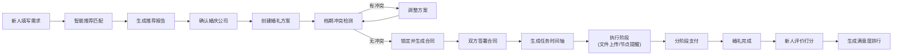

## 1. 产品概述

"良缘"婚庆策划协同平台是一款面向婚庆行业的一站式在线协同平台，连接新人、婚庆公司、供应商和财务四方角色，实现从需求匹配、方案制定、合同签署到任务执行、支付结算、评价反馈的全流程数字化管理。

- 解决婚庆行业信息不对称、沟通效率低、流程不透明的痛点
- 目标用户包括准新人、婚庆策划公司、各类婚庆供应商（摄影/化妆/主持/场地等）以及平台财务管理人员

## 2. 核心功能

### 2.1 用户角色

| 角色 | 登录方式 | 核心权限 |
|------|----------|----------|
| 新人 | 角色切换入口 | 填写预算与偏好、查看推荐报告、签署合同、上传文件、分阶段付款、评价供应商 |
| 婚庆公司 | 角色切换入口 | 创建婚礼方案、冲突检测、生成电子合同、查看任务时间轴、管理供应商 |
| 供应商 | 角色切换入口 | 查看推荐订单、在线报价、上传交付物、查看任务节点、管理档期 |
| 财务 | 角色切换入口 | 查看订单数据、收入统计、纠纷率监控、生成运营报表 |

### 2.2 功能模块

1. **角色切换入口页**：四角色卡片选择、快速进入工作台
2. **新人工作台**：待办提醒、推荐报告入口、我的婚礼方案、支付进度、文件管理
3. **新人需求填写**：预算滑块、风格选择、偏好标签、提交生成推荐
4. **推荐报告页**：婚庆公司推荐、供应商组合推荐、推荐理由、价格区间
5. **婚庆公司工作台**：待处理方案、合同管理、任务概览
6. **方案创建页**：场地选择、时间设置、供应商选配、冲突检测、锁定档期
7. **电子合同页**：合同内容展示、双方签署、合同下载
8. **供应商工作台**：推荐订单、报价管理、任务时间轴、交付物上传
9. **任务时间轴**：节点列表、倒计时提醒、状态追踪
10. **支付管理**：三阶段付款展示、里程碑触发、付款状态
11. **文件管理**：新人上传需求、供应商上传交付物、分类归档
12. **评价与排行**：评分系统、满意度排行榜、评价列表
13. **财务工作台**：数据概览、供应商统计、运营报表

### 2.3 页面详情

| 页面名称 | 模块名称 | 功能描述 |
|----------|----------|----------|
| 角色入口页 | 角色选择卡片 | 四种角色卡片展示，hover动效，点击进入对应工作台 |
| 角色入口页 | 平台介绍 | 平台标语、核心数据展示、底部信息 |
| 新人工作台 | 顶部导航 | 角色切换、消息通知、个人中心入口 |
| 新人工作台 | 待办卡片 | 待签署合同、待付款、待评价等数量展示 |
| 新人工作台 | 快捷操作 | 填写需求、查看推荐、上传文件等快捷入口 |
| 新人需求填写 | 预算设置 | 预算区间滑块、数字输入确认 |
| 新人需求填写 | 风格选择 | 卡片式风格选择（浪漫/简约/中式/森系/奢华等） |
| 新人需求填写 | 偏好标签 | 多选标签（户外/室内/海边/教堂等） |
| 推荐报告页 | 报告概览 | 预算匹配度、推荐组合总数、预计总价 |
| 推荐报告页 | 婚庆公司推荐 | 评分、案例数、价格区间、推荐理由 |
| 推荐报告页 | 供应商组合 | 摄影/化妆/主持/场地分项推荐 |
| 婚庆公司工作台 | 方案列表 | 进行中/已完成方案卡片列表 |
| 方案创建页 | 基础信息 | 新人姓名、婚期、场地选择 |
| 方案创建页 | 供应商选配 | 摄影/化妆/主持等供应商选择 |
| 方案创建页 | 冲突检测 | 一键检测场地与供应商档期冲突 |
| 电子合同页 | 合同正文 | 服务内容、价格、双方权责 |
| 电子合同页 | 签署区 | 双方签名确认、时间戳 |
| 供应商工作台 | 推荐订单 | 可接单列表、一键报价 |
| 供应商工作台 | 报价管理 | 已报价/已签约订单状态 |
| 任务时间轴 | 时间轴视图 | 试妆/彩排/婚礼等节点纵向时间轴 |
| 任务时间轴 | 节点详情 | 时间、地点、负责人、提醒设置 |
| 支付管理页 | 付款阶段 | 定金/中期/尾款三阶段进度展示 |
| 支付管理页 | 里程碑 | 每个阶段对应里程碑说明 |
| 文件管理页 | 分类目录 | 需求文件/交付物/合同等分类 |
| 文件管理页 | 文件列表 | 文件名、上传时间、大小、下载按钮 |
| 评价页面 | 评分组件 | 星级评分、标签评价、文字评价 |
| 评价页面 | 排行榜 | 满意度排行榜、好评词云预览 |
| 财务工作台 | 数据看板 | 总收入、订单数、纠纷率等核心指标 |
| 财务工作台 | 供应商排行 | 接单量、收入、满意度排行 |

## 3. 核心流程

新人登录平台后填写预算、风格和偏好，系统基于算法推荐婚庆公司和供应商组合。新人确认后，婚庆公司创建详细方案并检测档期冲突，无冲突则锁定并生成电子合同。双方签署后，系统自动生成任务时间轴并设置节点提醒。执行过程中，新人上传需求文件，供应商上传交付物。支付按定金、中期、尾款三阶段进行，与里程碑挂钩。婚礼结束后新人评分，系统生成满意度排行榜。财务按月统计运营数据生成报表。

## 4. 用户界面设计

### 4.1 设计风格

**主题方向**：浪漫雅致 · 轻奢质感

- **主色调**：玫瑰金渐变（#D4A574 → #C4956A），象征婚礼的温馨与浪漫
- **辅助色**：柔粉（#F8E2DE）、雾灰蓝（#A8B5C4）、象牙白（#FFFBF7）
- **点缀色**：勃艮第红（#722F37），用于重要操作按钮
- **按钮风格**：微圆角（8px）、轻阴影、hover时微妙上浮
- **字体**：标题使用衬线字体（Playfair Display / 思源宋体），正文使用现代无衬线（PingFang SC / HarmonyOS Sans）
- **布局风格**：卡片式布局，柔和阴影，大量留白
- **装饰元素**：细线分隔、淡金色描边、细微噪点纹理

### 4.2 页面设计概览

| 页面名称 | 模块名称 | UI元素 |
|----------|----------|--------|
| 角色入口页 | 角色卡片 | 渐变背景、图标微动效、悬停上浮、角色名称+一句话描述 |
| 新人需求填写 | 风格卡片 | 配图+标题+选中态描边、点击放大效果 |
| 推荐报告页 | 供应商卡片 | 头像/Logo、评分星星、价格标签、推荐理由标签 |
| 任务时间轴 | 时间轴线 | 纵向虚线、节点圆点、已完成高亮、即将到期脉冲动画 |
| 电子合同页 | 合同纸张 | 米白背景、细微纹理、模拟纸张质感、印章效果 |
| 支付管理页 | 进度条 | 分段进度条、里程碑节点标记、已完成金色填充 |

### 4.3 响应式

- 桌面端优先设计（1440px基准）
- 平板端自适应（1024px以上保持完整布局）
- 移动端单列布局，卡片堆叠，底部导航
- 触控区域不小于44px

### 4.4 动效设计

- 页面切换：淡入+轻微上移动效
- 卡片悬停：上浮4px + 阴影加深
- 按钮点击：缩放至0.96的微反馈
- 进度变化：平滑过渡动画（500ms ease）
- 提醒节点：呼吸脉冲动画，吸引注意力
- 数字变化：数字滚动动画
