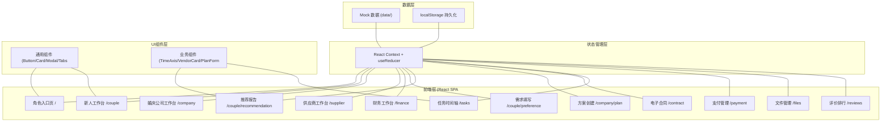
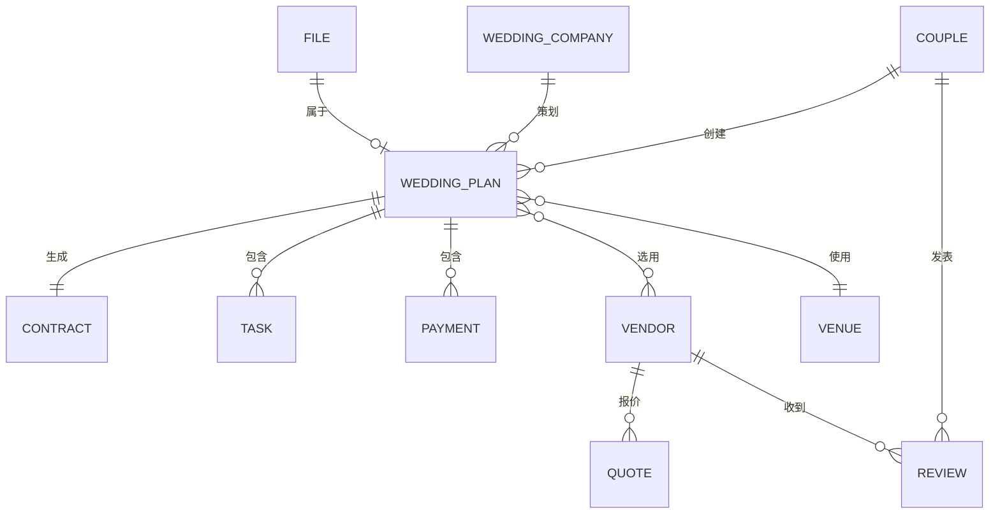

## 1. 架构设计



## 2. 技术描述

- **前端框架**: React@18 + TypeScript
- **构建工具**: Vite@5
- **样式方案**: TailwindCSS@3 + CSS 变量
- **路由**: React Router DOM@6
- **状态管理**: React Context + useReducer
- **图标**: Lucide React
- **后端**: 无后端，使用 Mock 数据 + localStorage 模拟后端
- **数据持久化**: localStorage 存储用户操作数据

## 3. 路由定义

| 路由路径 | 页面名称 | 说明 |
|----------|----------|------|
| `/` | 角色入口页 | 四种角色选择入口 |
| `/couple` | 新人工作台 | 新人首页，新人主页 |
| `/couple/preference` | 需求填写页 | 预算/风格/偏好填写 |
| `/couple/recommendation` | 推荐报告页 | 智能推荐结果展示 |
| `/couple/payment` | 支付管理页 | 三阶段付款 |
| `/couple/files` | 文件管理页 | 需求文件与交付物 |
| `/couple/reviews` | 评价页面 | 评分与满意度排行 |
| `/company` | 婚庆公司工作台 | 婚庆公司首页 |
| `/company/plan/create` | 创建方案页 | 创建婚礼方案 |
| `/company/plan/:id` | 方案详情页 | 方案查看与编辑 |
| `/contract/:id` | 电子合同页 | 合同查看与签署 |
| `/supplier` | 供应商工作台 | 供应商首页 |
| `/supplier/quotes` | 报价管理 | 报价列表 |
| `/tasks` | 任务时间轴 | 全角色任务时间轴 |
| `/finance` | 财务工作台 | 财务数据概览 |

## 4. 数据模型

### 4.1 数据模型定义



### 4.2 核心数据结构

```typescript
// 新人
interface Couple {
  id: string;
  name: string;
  avatar: string;
  budget: number;
  style: string;
  preferences: string[];
}

// 婚庆公司
interface WeddingCompany {
  id: string;
  name: string;
  logo: string;
  rating: number;
  caseCount: number;
  priceRange: [number, number];
  description: string;
  tags: string[];
}

// 供应商
interface Vendor {
  id: string;
  name: string;
  type: 'photography' | 'makeup' | 'host' | 'venue' | 'flower' | 'catering';
  avatar: string;
  rating: number;
  price: number;
  schedule: string[]; // 可用档期日期
  description: string;
}

// 婚礼方案
interface WeddingPlan {
  id: string;
  coupleId: string;
  companyId: string;
  venueId: string;
  weddingDate: string;
  vendors: string[]; // 供应商ID列表
  status: 'draft' | 'pending' | 'confirmed' | 'completed';
  totalPrice: number;
  createdAt: string;
}

// 合同
interface Contract {
  id: string;
  planId: string;
  content: string;
  signedByCouple: boolean;
  signedByCompany: boolean;
  signedAt: string | null;
}

// 任务节点
interface Task {
  id: string;
  planId: string;
  title: string;
  description: string;
  date: string;
  type: 'makeup_test' | 'rehearsal' | 'wedding' | 'delivery';
  status: 'pending' | 'in_progress' | 'completed';
  assignee: string;
}

// 付款
interface Payment {
  id: string;
  planId: string;
  stage: 'deposit' | 'middle' | 'final';
  amount: number;
  status: 'pending' | 'paid' | 'overdue';
  dueDate: string;
  milestone: string;
}

// 评价
interface Review {
  id: string;
  coupleId: string;
  vendorId: string;
  rating: number;
  tags: string[];
  comment: string;
  createdAt: string;
}

// 文件
interface FileItem {
  id: string;
  planId: string;
  name: string;
  type: 'requirement' | 'delivery' | 'contract';
  url: string;
  uploadedBy: string;
  uploadedAt: string;
  size: number;
}
```

## 5. 目录结构

```
src/
├── assets/          # 静态资源
├── components/      # 通用组件
│   ├── ui/      # 基础UI组件
│   └── business/ # 业务组件
├── contexts/      # Context 状态管理
├── data/          # Mock 数据
├── hooks/         # 自定义 hooks
├── pages/         # 页面组件
│   ├── entry/    # 角色入口
│   ├── couple/   # 新人端
│   ├── company/  # 婚庆公司端
│   ├── supplier/ # 供应商端
│   ├── finance/  # 财务端
│   └── shared/   # 共享页面（合同/任务/支付/文件/评价）
├── types/         # TypeScript 类型定义
├── utils/         # 工具函数
├── App.tsx
├── main.tsx
└── index.css
```

## 6. 关键技术决策

1. **单页应用 (SPA)：所有页面在前端路由切换，无需后端支持，使用 Mock 数据即可完整体验

2. **状态集中管理**：使用 React Context 管理全局应用状态（当前角色、方案数据、消息等），支持多角色切换

3. **本地持久化**：用户操作数据存储在 localStorage 中，刷新页面数据不丢失

4. **冲突检测算法**：基于日期和供应商ID进行简单的档期冲突检测，前端模拟实现

5. **推荐算法**：基于评分、价格匹配度、档期可用性的加权推荐算法，前端模拟实现

6. **UI 组件化**：抽离通用 UI 组件（Button、Card、Modal、Tabs 等），保证设计一致性
